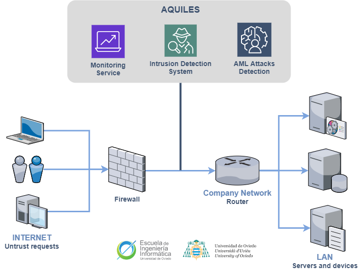

[](https://github.com/SergioArroni/TFG-Apolo/actions)
[](https://sonarcloud.io/project/overview?id=SergioArroni_TFG-Apolo)

# **Apolo**: Sistema inteligente de monitorización  y detección de ataques basados en inteligencia artificial

## Descripción

Diseño de un sistema inteligente que, mediante el uso de técnicas de Machine Learning se encarga de la monitorización del tráfico en una red, capaz de detectar intrusos (IDS) y ataques generados mediante técnicas de inteligencia artificial (AML).

* **Autor:** Sergio Arroni Del Riego
* **Tutor:** Antonio Payá González
* **Tutor:** Vicente García Díaz



## Estrucutra del proyecto

```bash
├── papers
│   ├── apollon
│   │   ├── attacks
│   │   ├── datasets
│   │   ├── intrusion_detection_systems
│   │   ├── MAB
│   │   ├── results
│   │   └── shared
│   ├── apollon-paper
│   │   ├── Results
│   │   ├── Sections
│   │   └── *.tex
│   ├── Harpe
│   │   ├── documentation
│   │   ├── harpe
│   │   ├── sdp-environment
│   │   └── results
│   └── Harpe-paper
│       ├── Results
│       ├── Sections
│       ├── Figures
│       └── *.tex
├── TFG
│   ├── cicflowmeter
│   ├── documentation
│   │   ├── diagrams
│   │   └── images
│   ├── elk
│   │   ├── pipeline
│   │   └── *.yml
│   ├── gateway
│   ├── ids
│   │   ├── apolo
│   │   │    ├── layers
│   │   │    ├── model_predict
│   │   │    ├── model_train
│   │   │    ├── preprocesing
│   │   │    ├── results
│   │   │    └── saved_apolo
│   │   ├── services
│   │   ├── storage
│   │   ├── utils
│   │   ├── main*.py
│   │   └── requirements.txt
│   ├── elk
│   │   ├── api
│   │   └── webpage
│   ├── .env.example
│   ├── .gitignore
│   └── docker-compose
├── .gitignore
└── README.md
```

## Documentación

La documentación del proyecto se encuentra en el directorio `TFG/documentation`, en el se encuentra el archivo del TFG en word y en pdf, asi como todas las im´sgenes y diagramas utilizados. Los papers de la investigación realizada se encuentran en el directorio `papers/apollon-paper` y en el directorio `papers/Harpe-paper` para los papers Apollon y Harpe, respectivamente.

## TFG

Para la demo que se utilizará en el Trabajo de Fin de Grado, de ha desarrollado un entorno que simula una red de ordenadores conectados a través de una red local. Este entorno se encuentra en el directorio `TFG` y se ha desarrollado mediante el uso de Docker y Docker-Compose. Para poder utilizar el entorno, primero es necesario asegurarse de tener instalado Docker y Docker-Compose en su ordenador. Una vez que se tiene instalado Docker y Docker-Compose, se puede utilizar el siguiente comando desde la línea de comandos para levantar el entorno:

```bash
docker-compose up -d --build
```

## Research Source Code

El código fuente de la investigación se encuentra en los directorios `papers/apollon` y `papers/Harpe` para los papers Apollon y Harpe, respectivamente.
